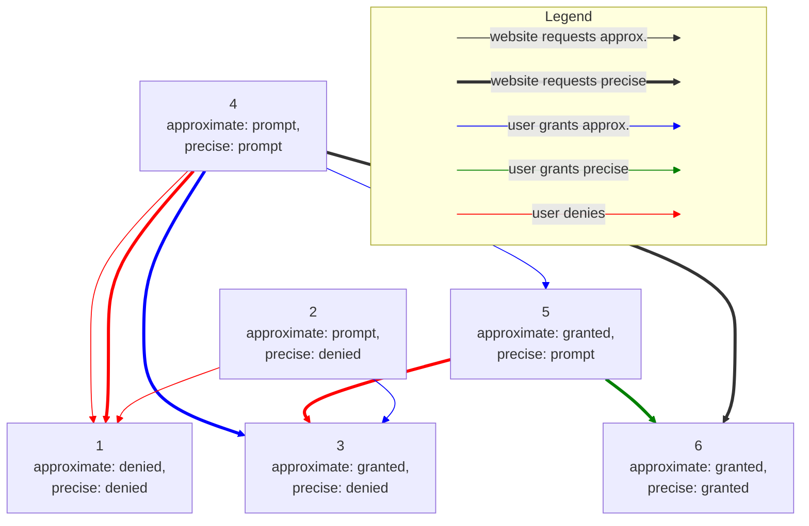

# Approximate Geolocation - Permission states and transitions

The possible states for the permissions `"geolocation"` and `"geolocation-approximate"` will be

|    | `geolocation-approximate` | `geolocation` |
|----|:-------------------------:|:-------------:|
| 1. | `denied`                  | `denied`      |
| 2. | `prompt`                  | `denied`      |
| 3. | `granted`                 | `denied`      |
| 4. | `prompt`                  | `prompt`      |
| 5. | `granted`                 | `prompt`      |
| 6. | `granted`                 | `granted`     |

Transitions between those states are summarized in the following table:

| Initial state | Website requests `"approximate"`                                                    | Website requests `"precise"`                                                                                                                      |
|---------------|-------------------------------------------------------------------------------------|------------------------------------------------------------------------------------------------------------------------------------------------|
| 1.            | No prompt, website gets `PERMISSION_DENIED`                                         | No prompt, website gets `PERMISSION_DENIED`                                                                                                    |
| 2.            | Prompt for approximate only and transition to 3. (if granted) or 1. (if denied).    | Prompt for approximate only and transition to 3. (if granted) or 1. (if denied).                                                               |
| 3.            | Return approximate location.                                                        | Return approximate location.                                                                                                                   |
| 4.            | Prompt for approximate location and transition to 5. if granted. or 1. (if denied). | Prompt for either approximate or precise location and transition to 3. (if granted approximate) and 6. (if granted precise) or 1. (if denied). |
| 5.            | Return approximate location.                                                        | Prompt to upgrade from approximate to precise location and transition to 6. (if granted) or 3. (if denied).                                    |
| 6.            | Return approximate location.                                                        | Return precise location.                                    |

and in the following diagram:

Finally, this is how `Permissions.query()` would behave in the different states:

|    | `query` for `"geolocation-approximate"` | `query` for `"geolocation"`                 |
|----|:---------------------------------------:|:-------------------------------------------:|
| 1. | `state: "denied"`                       | `state: "denied"`                           |
| 2. | `state: "prompt"`                       | `state: "prompt", accuracy: "approximate"`  |
| 3. | `state: "granted"`                      | `state: "granted", accuracy: "approximate"` |
| 4. | `state: "prompt"`                       | `state: "prompt", accuracy: "precise"`      |
| 5. | `state: "granted"`                      | `state: "prompt", accuracy: "precise"`      |
| 6. | `state: "granted"`                      | `state: "granted", accuracy: "precise"`     |

In particular, `Permissions.query()` returns `"granted"`, `"denied"`, or
`"prompt"` based on whether the corresponding call to `getCurrentPosition()` or
`watchPosition()` would return a position, or throw `PERMISSION_DENIED`, or
result in a prompt to the user, respectively.
