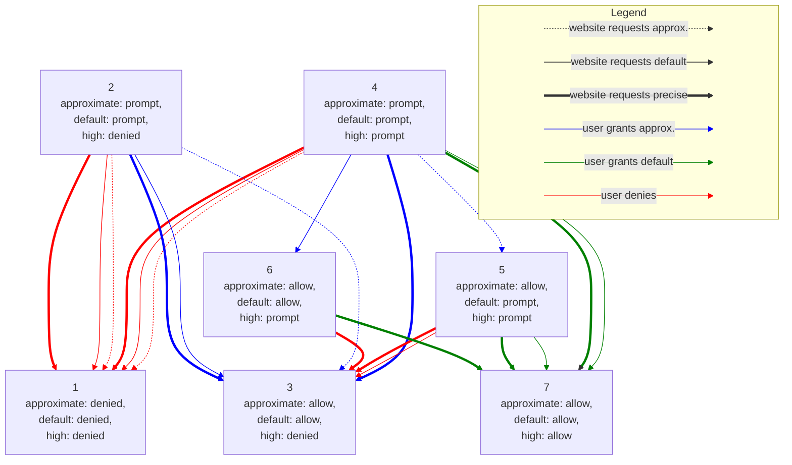

# Approximate Geolocation - Permission states and transitions

The `GeolocationPermissionDescriptor` will contain a new `accuracyMode` aspect:

```webidl
dictionary GeolocationPermissionDescriptor : PermissionDescriptor {
  AccuracyMode accuracyMode = "default";
}

enum AccuracyMode {
  "default",
  "high",
  "approximate"
}
```

with the constraint that `"high"` is [stronger
than](https://w3c.github.io/permissions/#ref-for-dfn-stronger-than-1)
`"default"`, which is stronger than `"approximate"`.

In particular, if `"approximate"` is `"denied"` then also the other ones will be
`"denied"`, while  if `"high"` is `"granted"`  then also the other ones will be
`"granted"`.

Moreover, when `"high"` is `"denied"` (for example, this could also happen when
access to precise location has been blocked via Permissions Policy) then
`"default"` will behave exactly as `"approximate"`, so there are seven possible
valid states for the `"geolocation"` permission:

|    | `approximate` | `default` | `high`    |
|----|:-------------:|:---------:|:---------:|
| 1. | `denied`      | `denied`  | `denied`  |
| 2. | `prompt`      | `prompt`  | `denied`  |
| 3. | `allow`       | `allow`   | `denied`  |
| 4. | `prompt`      | `prompt`  | `prompt`  |
| 5. | `allow`       | `prompt`  | `prompt`  |
| 6. | `allow`       | `allow`   | `prompt`  |
| 7. | `allow`       | `allow`   | `allow`   |

Transitions between those states are summarized in the following table:

| Initial state | Website requests `"approximate"`                                                     | Website requests `"default"`                                                                                                                   | Website requests `"high"`                                                                                                                      |
|---------------|--------------------------------------------------------------------------------------|------------------------------------------------------------------------------------------------------------------------------------------------|------------------------------------------------------------------------------------------------------------------------------------------------|
| 1.            | No prompt, website gets `PERMISSION_DENIED`                                          | No prompt, website gets `PERMISSION_DENIED`                                                                                                    | No prompt, website gets `PERMISSION_DENIED`                                                                                                    |
| 2.            | Prompt for approximate only and transition to 3. (if granted) or 1. (if denied).     | Prompt for approximate only and transition to 3. (if granted) or 1. (if denied).                                                               | No prompt, website gets `PERMISSION_DENIED`                                                                                                    |
| 3.            | Return approximate location.                                                         | Return approximate location.                                                                                                                   | No prompt, website gets `PERMISSION_DENIED`                                                                                                    |
| 4.            | Prompt for approximate location and transition to 5. if granted. or 1. (if denied).  | Prompt for either approximate or precise location and transition to 6. (if granted approximate) and 7. (if granted precise) or 1. (if denied). | Prompt for either approximate or precise location and transition to 3. (if granted approximate) and 7. (if granted precise) or 1. (if denied). |
| 5.            | Return approximate location.                                                         | Prompt to upgrade from approximate to precise location and transition to 7. (if granted) or 3. (if denied).                                    | Prompt to upgrade from approximate to precise location and transition to 7. (if granted) or 3. (if denied).                                    |
| 6.            | Return approximate location.                                                         | Return approximate location.                                                                                                                   | Prompt to upgrade from approximate to precise location and transition to 7. (if granted) or 3. (if denied).                                    |
| 7.            | Return approximate location.                                                         | Return precise location.                                                                                                                       | Return precise location.                                                                                                                       |

and in the following diagram:


